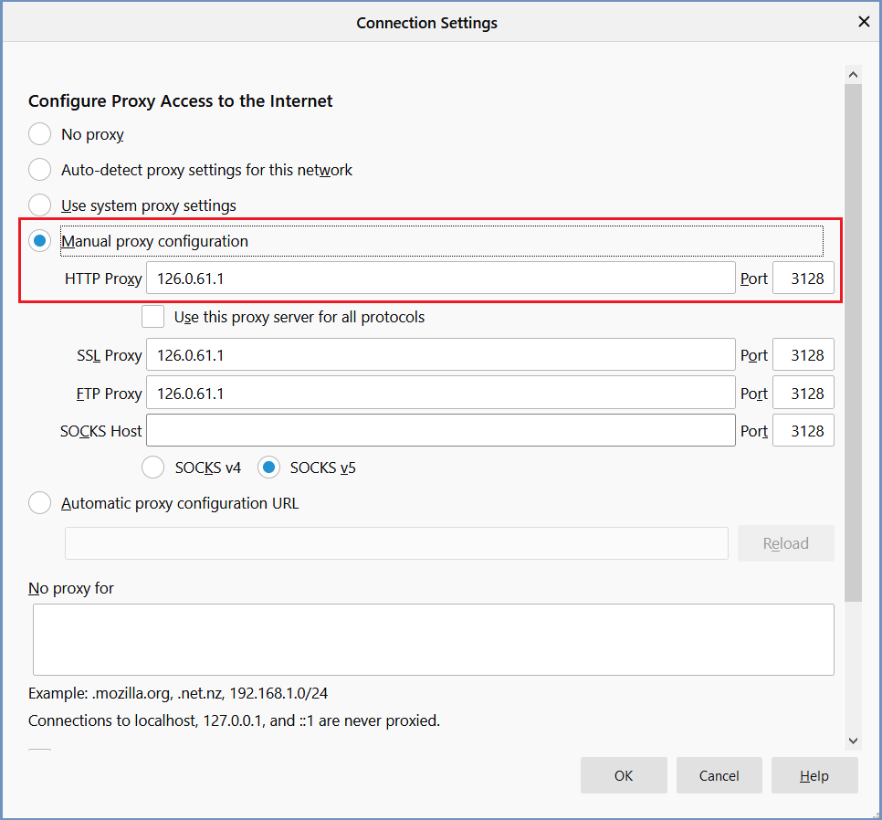

Firefox
=======

Open a browser and go to `<about:preferences>`. Scroll down to the ``Network Proxy`` section and select ``Settings``

	
	*Connection Settings*	
	
* Check the option ``Manual proxy configuration``.  
* Enter the shield proxy hostname in the ``HTTP Proxy`` field.  
* Enter the port ``3128`` in the ``Port`` field.
* For Firefox 71 - enter the hostname in the SSL and FTP proxies (SOCKS host must remain empty)
* For previous versions - check the option ``Use this proxy server for all protocols``

Click ``OK`` to save the configuration.
