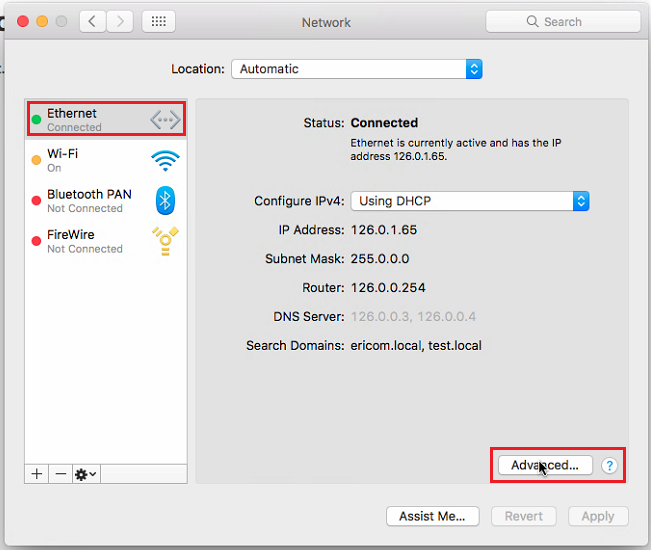

Safari
======

Open a Safari browser and click the apple icon on the top left corner. Select the ``System Preferences...`` option.

.. figure:: images/SafariSysPref.png
	:scale: 75%
	:align: center

Click ``Network``

On the left, select the desired network and the click the ``Advanced`` option (bottom right).

Click the ``Proxies`` option in the upper bar, then, on the left-hand side, mark the ``Web Proxy (HTTP)`` checkbox, and on the right-hand side, enter the ``<ShieldHostname>`` in the ``Web Proxy Server`` field. Update the port ``3128`` as well.

Repeat these steps for the ``Secure Web Proxy (HTTPS)`` option.

In the lower section, ``Bypass proxy settings for these Hosts & Domains`` enter all IP addresses or domains that should be opened directly, not via Shield.

Click ``OK``.